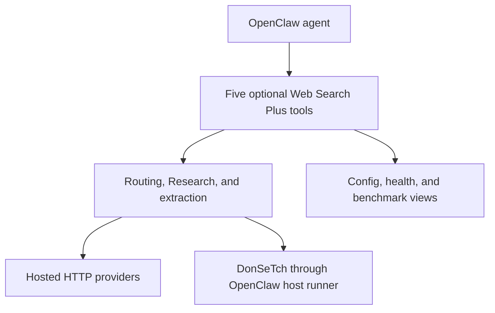

# Architecture

## Overview

`web-search-plus-plugin` is a source-only TypeScript implementation with a small local module split. It registers five optional tools directly in OpenClaw and performs routing, hosted-provider HTTP, retries, caching, cooldown tracking, Research aggregation, provenance, extraction, and SearXNG SSRF checks in-process. DonSeTch is the sole external-process boundary: the plugin delegates an exact argv to OpenClaw's trusted host runner and never imports `node:child_process` itself.



Because all five tools are registered with `optional: true`, normal onboarding adds the exact desired names—`web_search_plus`, `web_extract_plus`, `web_routing_config_plus`, `web_search_health_plus`, and/or `web_extract_benchmark_plus`—through `tools.alsoAllow`, preserving the host's profile-derived tools. `tools.allow` is an intentionally restrictive absolute alternative. Plugin loading through `plugins.allow` and sandbox tool policy are separate gates.

## Core Design

### Runtime module layout

The runtime entry lives in `index.ts`, with local helper modules for configuration mapping, scanner-safe routing preferences, Research/provenance, bounded provider HTTP, extraction spans, and DonSeTch's host-runner transport.

Together they cover:
- Type definitions for tool input/output and internal state
- Environment/config loading
- Shared bounded HTTP request helper built on native `fetch()`
- In-memory cache helpers
- Provider health and cooldown state management
- SearXNG SSRF validation using `dns/promises` and `net`
- Query analysis and auto-routing heuristics
- Provider-specific request/response adapters, including static Octen and TinyFish modules
- DonSeTch stdio MCP framing over the injected OpenClaw command runner
- Retry + fallback logic
- Cross-provider deduplication
- OpenClaw plugin entry + tool registration

One plugin runtime, local TypeScript modules, and zero bundled runtime dependencies. DonSeTch is optional, separately installed, and independently licensed.

## Runtime Layers

### 1. Types

Static types define the public tool contract and the normalized internal response shape.

Examples:
- `ToolParams`
- `ProviderName`
- `SearchResult`
- `SearchResponse`
- structured error classes such as `ProviderConfigError` and `ProviderRequestError`

### 2. Config

The bundled runtime reads provider values from explicit OpenClaw plugin config fields and does not directly read external credential state.

This keeps credential access explicit and avoids mixing plugin runtime behavior with host-wide environment state.

### 3. Provider I/O

Hosted provider calls use native `fetch()` from Node.js. Octen and TinyFish additionally use a fixed-origin, redirect-refusing, response-bounded helper so credentials cannot follow redirects and untrusted bodies cannot grow without limit.

Shared request behavior includes:
- JSON request/response handling
- common headers/body construction
- response status validation
- output sanitization for errors
- per-request timeout via `AbortController`
- transient error classification for retries (`408`, `425`, `429`, `500`, `502`, `503`, `504`)

The optional DonSeTch adapter does not use `fetch()` or import `child_process`. It sends `[donsetchBin, "mcp"]`, bounded stdin, an isolated environment, and timeout/output limits to the host-owned `api.runtime.system.runCommandWithTimeout` function. One initialized stdio MCP session serves one Web Search Plus request, including multi-URL extraction.

### 4. Cache

The runtime cache is process-local memory. The package intentionally avoids runtime filesystem reads so ClawHub does not classify benign cache/config access as potential exfiltration.

Characteristics:
- cache key is derived from query + provider + result count + relevant search parameters
- cache metadata tracks timestamp, params, provider, and query context
- default TTL is currently one hour
- cache entries expire lazily on read
- cache writes update process memory only

### 5. Provider Health / Cooldown

Provider health state is process-local memory alongside the cache.

Behavior:
- repeated failures increase a provider's failure count
- cooldown duration grows across predefined backoff steps
- providers currently in cooldown are skipped when possible
- successful requests reset provider health state

This reduces repeated failures against rate-limited or degraded providers and improves fallback quality.

### 6. SSRF Protection

SearXNG support includes host validation before any request is sent.

Checks include:
- URL parsing and hostname validation
- DNS resolution using `dns/promises`
- IP classification using Node.js `net`
- blocking private, loopback, link-local, and metadata-style targets by default
- optional private-instance override through explicit plugin configuration

Implemented entirely in TypeScript with Node.js builtins.

### 7. QueryAnalyzer

The auto-router inspects query content and scores providers by intent.

Signals include:
- shopping / pricing intent
- research / explanation intent
- multilingual or geo-rich search intent
- semantic discovery intent
- query complexity heuristics
- provider availability

The router returns an internal provider choice and confidence estimate, with transparent class/language signals. Exa depth is not a public routing or tool parameter: the source-only adapter uses neural Search and rejects synthesis modes before network dispatch.

### 8. Providers

Core hosted providers have dedicated adapter functions in `index.ts`; bounded or process-backed providers use focused modules.

Current providers:
- Serper
- Brave
- Tavily
- Linkup
- Querit
- Exa
- Firecrawl
- Parallel
- SerpBase
- You.com
- SearXNG
- Keenable
- Octen via Monid
- TinyFish
- DonSeTch

Each adapter is responsible for:
- auth handling
- provider-specific request shape
- optional feature mapping (`time_range`/freshness, news, locale, and domain filters)
- response parsing
- normalization into a shared output schema

Exa provides source-only neural `/search` and translates unified freshness into absolute UTC publication bounds. Parallel uses stable `/v1/search`, defaults to mode `fast`, and is auto-allowed when configured. Octen and TinyFish are source-only Search providers guarded by default. DonSeTch is a separately installed Search/Markdown-Extract provider guarded by default; its adapter owns MCP framing and normalization while OpenClaw owns process execution.

### 9. Retry / Fallback

When a request fails transiently, the plugin retries with exponential backoff plus bounded random jitter (up to 50% of the base delay) so concurrent retries against a recovering provider do not synchronize into bursts.

If a provider still fails:
- the failure is recorded in provider health state
- the router/fallback chain tries the next eligible configured provider
- cooldown-skipped providers are tracked in output metadata when relevant


### 10. Dedup

When fallback or merged responses produce overlapping links, `research.ts` clusters canonical URLs. The public result head remains compact, but cross-provider evidence is not discarded: clusters keep deterministic observation ids and attributed snippet fragments, plus provider-neutral `source_type` and explainable `fetch_priority` hints.

### 10b. Quality: rerank + authority signals (`quality.ts`)

For authority-sensitive routing classes (`official/vendor-release`, `docs/api`, `official/regulatory`, `finance/IR`, `security/cve`), auto-routed results pass through a small canonical-source reranker before caching: canonical domains are boosted, mirror/repost domains demoted, and any reordering is reported in `metadata.intent_rerank`. Quality reports include `authority_signals` (canonical domain hits, demoted domain hits, primary-source top-result flag) built from the same rules.

### 10c. Research mode (`research.ts`)

`mode="research"` orchestrates a compact multi-provider sweep. Up to three providers run concurrently and completions are harvested as they arrive, preventing a blocked earlier submission from hiding later evidence. Results, attempts, and diagnostics are restored to submission order before public projection. The default quality quorum can preempt only still-pending work after two providers meet the unique-result target (`min(count, 5)`) and unique-domain target (`min(result_target, 3)`); omissions remain visible as `preempted_after_quorum`. The top URLs are extracted through `extract.ts` into `source_summaries`. A wall-clock budget gates provider launches, completion waits, and extraction. Research responses are not cached.

### 11. Plugin Entry

The OpenClaw plugin entry:
- registers five optional tools: Search, Extract, routing config, provider health, and extraction benchmark
- exposes JSON-schema tool contracts declared as owned in the manifest
- validates and normalizes tool parameters
- performs routing, execution, caching, retries, fallback, and final result shaping
- returns structured JSON back to OpenClaw

## Tool Parameters

The registered tool currently supports:

| Parameter | Type | Notes |
|-----------|------|-------|
| `query` | string | Required search query |
| `provider` | string | `serper`, `brave`, `tavily`, `linkup`, `querit`, `exa`, `firecrawl`, `parallel`, `serpbase`, `you`, `searxng`, `keenable`, `octen`, `tinyfish`, `donsetch`, or `auto` |
| `count` | number | Result count, clamped to safe limits |
| `time_range` | string | `day`, `week`, `month`, `year` where supported |
| `include_domains` | string[] | Provider-specific domain allowlist |
| `exclude_domains` | string[] | Provider-specific domain denylist |
| `quality_report` | boolean | Attach routing/result-quality/authority diagnostics |
| `mode` | string | `normal` (default) or `research` multi-provider + extraction |
| `research_providers` | string[] | Explicit provider list for research mode |
| `research_extract_count` | number | Top research URLs to extract (default 3, max 5) |
| `research_time_budget` | number | Best-effort research wall-clock budget in seconds (default 55) |

## Data Flow

```
1. Agent invokes web_search_plus(query="iPhone price", provider="auto")
2. Plugin normalizes params and loads runtime config
3. Cache lookup runs using query/provider/parameter context
4. On cache miss, QueryAnalyzer scores available providers
5. A hosted provider is called with bounded `fetch()`, or DonSeTch is invoked through the OpenClaw host runner
6. If request fails transiently, retry logic applies
7. If provider still fails, fallback chain tries the next healthy provider
8. Provider response is normalized to shared result schema
9. Results are deduplicated if multiple providers contributed
10. Final result is cached in process memory and returned to OpenClaw
```

## File Structure

```
web-search-plus-plugin/
├── index.ts                 # Runtime core: tool registration + search engine
├── extract.ts               # Extraction providers + auto fallback chain
├── research.ts              # Completion-order Research + quorum/provenance
├── span-extraction.ts       # Deterministic sentence/heading evidence spans
├── provider-http.ts         # Fixed-origin bounded hosted-provider HTTP
├── octen-provider.ts        # Octen via Monid source Search
├── tinyfish-provider.ts     # TinyFish source Search + privacy metadata
├── donsetch-provider.ts     # DonSeTch source Search/Markdown Extract adapter
├── donsetch-transport.ts    # Stdio MCP over OpenClaw host command runner
├── quality.ts               # Canonical-source rerank + authority signals
├── routing-config.ts        # Routing preferences (in-memory, schema v2)
├── runtime-config.ts        # Plugin config → runtime config mapping
├── openclaw.plugin.json     # Plugin metadata
├── package.json             # npm package config
├── .gitignore
├── LICENSE                  # MIT
├── README.md                # User documentation
├── CHANGELOG.md             # Version history
├── SKILL.md                 # Plugin summary / usage notes
├── docs/
│   └── ARCHITECTURE.md      # This file
└── dist/index.js            # Built ClawPack runtime
```

## Security Model

- **No direct `child_process` or shell execution** — optional DonSeTch runs only through OpenClaw's injected, timeout-bounded host runner with an exact argv
- **No Python runtime requirement** — the plugin and its host-runner adapter are TypeScript; DonSeTch is an optional independent executable
- **Native `fetch()` with `AbortController` timeout** — requests cannot hang indefinitely
- **API keys stay explicit** in OpenClaw plugin config
- **Input validation** on all tool parameters
- **Sanitized errors** to avoid leaking credentials/tokens
- **SSRF protection** for SearXNG before outbound requests
- **Provider cooldowns** reduce repeated failing calls
- **Zero external runtime dependencies** — only Node.js builtins are used

## Changes from v1.x

Removed in v2.0.0:
- `scripts/search.py`
- `scripts/setup.py`

The legacy Python subprocess architecture remains replaced by the in-process TypeScript implementation. The optional DonSeTch 4.2.9 boundary is narrower: a separately installed executable is invoked only through OpenClaw's host-owned runner and stdio MCP contract.
